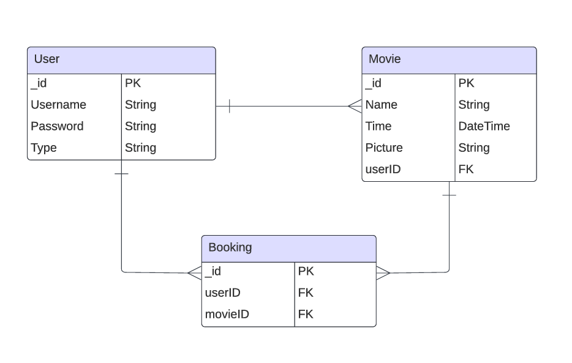
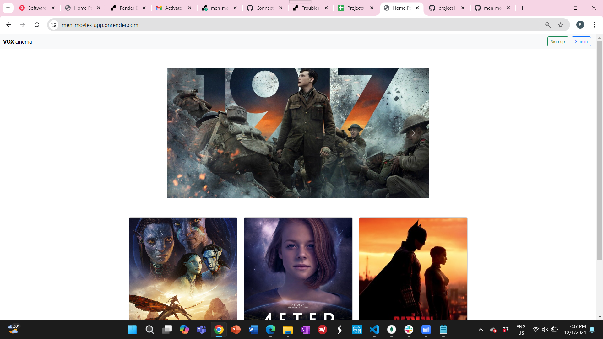
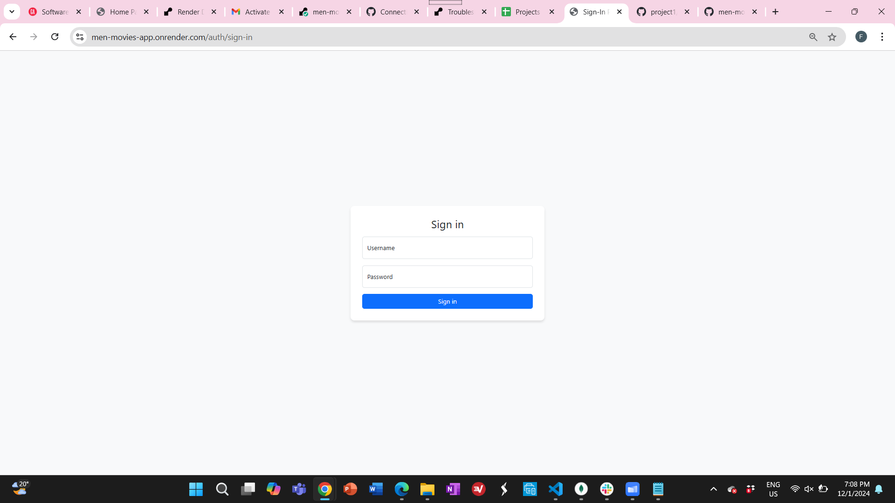
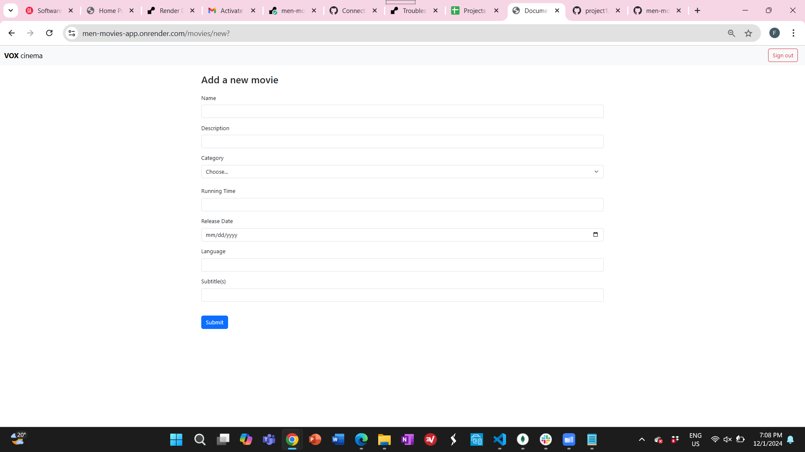
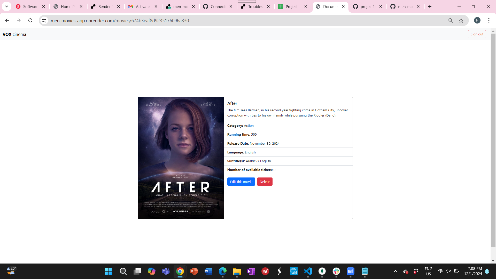
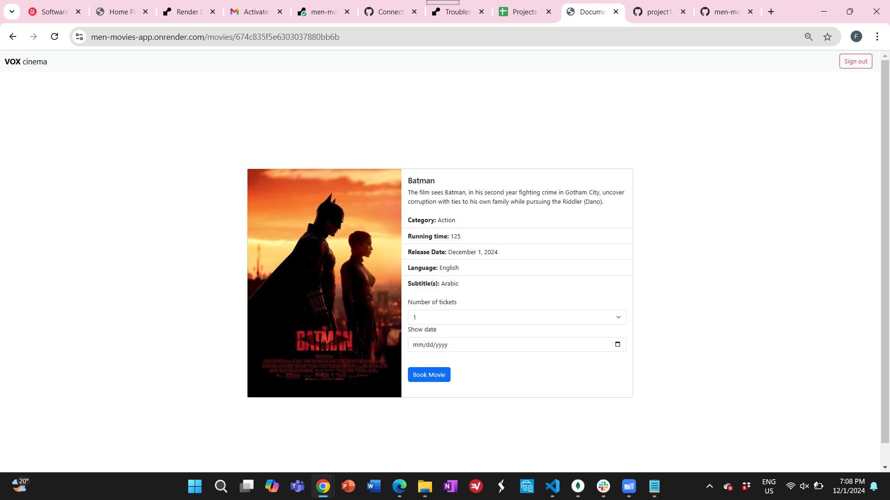
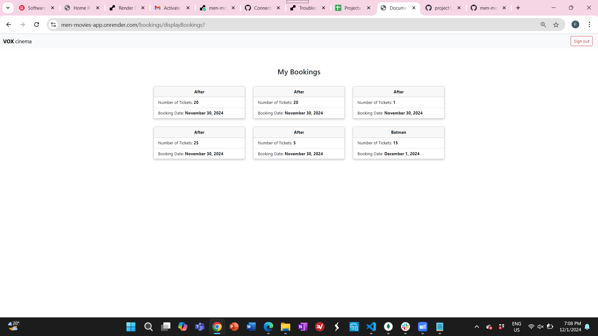

# Movies web application

**Movies web application** is used to allow users to view the available movies, edit them, book them, and perform other type of operations on them.

Deployed Link [VOX cinema](https://men-movies-app.onrender.com/)

# ERD:

# Technologies used:

1. Node.js
2. server.js
3. mongoDB
4. For front-end bootstrap is used

# User stories:

1. Unregistered users will only be able to view the available movies name and description.
2. Admin will be able to view a movie.
3. Admin will be able to add a movie.
4. Admin will be able to edit a movie.
5. Admin will be able to delete a movie.
6. Normal registered users will be able to view movies.
7. Normal registered users will be book a movie.

# future work:

1. Add upload functionality.
2. Add payment functionality.
3. Add review functionality.

# Screenshots from the web application 'wireframe':

